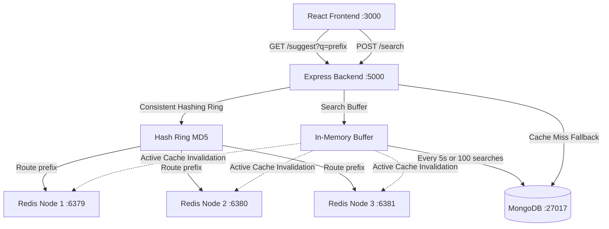

# Distributed Search Typeahead System

A production-grade Search Typeahead (autocomplete) application built using the MERN stack (MongoDB, Express, React, Node.js) with:
1. **Consistent Hashing Cache Layer** distributed across 3 independent logical Redis instances.
2. **High-Performance Write Buffer** that aggregates searches in memory and performs bulk updates (MongoDB `bulkWrite`) periodically or by size limit, significantly reducing database write pressure.
3. **Active Cache Invalidation** that clears affected prefix keys from the cache ring upon flushing search counts.
4. **Minimal and Elegant Autosuggest UI** providing a centered lookup bar and autocomplete suggestions dropdown.

---

## How to Start the App

### Requirements
* **Docker Desktop** must be installed and running.
* **Node.js** (v18+) must be installed (only to run the orchestrator script).

### Steps
1. **Clone the Repository**:
   Open a terminal and clone the repository, then navigate into the project root directory:
   ```bash
   git clone https://github.com/jineshgandhi79/TypeAhead.git
   cd TypeAhead
   ```
2. **Download the Dataset**: 
   - Download the raw Wikipedia titles dataset from [https://dumps.wikimedia.org/enwiki/latest/enwiki-latest-all-titles-in-ns0.gz](https://dumps.wikimedia.org/enwiki/latest/enwiki-latest-all-titles-in-ns0.gz).
   - Extract the downloaded archive, place the file at the root of the project, and rename it `dataset` (without any file extension).
3. Run the start file:
   ```cmd
   node run.js
   ```
   *(Or run `node run.js` directly).*
4. This script will run `docker-compose up --build`, spinning up MongoDB, the three Redis nodes, building the backend and frontend containers, running the database preload, and launching the services.
5. Once running, open your web browser and go to:
   ```
   http://localhost:3000
   ```

---


## Port Configurations

| Service | Host Port | Internal Container Port | Description |
| :--- | :--- | :--- | :--- |
| **React Frontend** | `3000` | `3000` | Minimal centered Search UI |
| **Express Backend** | `5000` | `5000` | REST API, batch writer, and hash ring routing |
| **MongoDB** | `27017` | `27017` | Persistent data store for queries and scores |
| **Redis Node 1** | `6379` | `6379` | Cache Node 1 (Key range 1) |
| **Redis Node 2** | `6380` | `6379` | Cache Node 2 (Key range 2) |
| **Redis Node 3** | `6381` | `6379` | Cache Node 3 (Key range 3) |

---

## System Architecture



---

## Detailed System Design Decisions

### 1. Consistent Hashing Cache Ring
To scale the cache horizontally, the prefix keys are distributed across 3 independent Redis nodes using a custom **Consistent Hash Ring** (`consistentHash.js`):
* **MD5 Hashing**: Hashes keys to a 32-bit unsigned integer space $[0, 2^{32} - 1]$.
* **Virtual Nodes**: To prevent clustering and ensure uniform key distribution, each physical node is assigned **100 virtual nodes** (replicas) placed randomly on the ring.
* **Routing Lookup**: A binary search ($O(\log N)$) is performed on the sorted ring array to find the first virtual node hash $\ge$ the key's hash (wrapping around to the first node if none is found).

### 2. Batch Write Buffer
To reduce database write load:
* Search clicks are buffered in memory (`Map<query, { count }>()`).
* **Aggregation**: If the same query is searched multiple times within the batch, we aggregate the counts.
* **Flush Trigger**: Flushes to MongoDB occur **every 5 seconds** or when the buffer reaches a size of **100 searches**.
* **Bulk Write**: Writes are committed to MongoDB in a single command using `bulkWrite` with `updateOne` upserts.
* **Failure Trade-offs**: In-memory buffering yields near-zero latency and massive DB write savings. However, in the event of an application crash, the searches in the current buffer (up to 5 seconds of logs) would be lost. For autocomplete logs, this is a standard industry trade-off. (In a mission-critical pipeline, we could introduce a Write-Ahead Log or a Redis Stream queue).
* **Active Cache Invalidation**: Upon flushing, the backend generates all prefixes (up to length 10) of the updated queries, calculates their corresponding Redis nodes, and deletes the cached items. This ensures that suggestions update instantly after a batch write.

---

## Preloading the Dataset

Before running the application, you must download the Wikipedia raw dataset:
1. Download the gzipped titles file from: [https://dumps.wikimedia.org/enwiki/latest/enwiki-latest-all-titles-in-ns0.gz](https://dumps.wikimedia.org/enwiki/latest/enwiki-latest-all-titles-in-ns0.gz)
2. Extract the archive.
3. Save the extracted file at the root of the project and name it `dataset` (without any file extension).

Once the dataset is in place:
* On startup, the backend automatically drops the database to rebuild indexes and preloads the clean dataset.
* The script streams the file line-by-line using Node's `readline` module (low memory usage).
* It cleans each query (replaces underscores with spaces, removes all other special characters, collapses spaces), generates a random count between **10 and 100,000**, and bulk-inserts them in batches of 10,000.
* It stops reading once it reaches the **150,000** limit (configurable via `PRELOAD_LIMIT`).
* **Test Seeds**: It also seeds specific test queries (like `Apple iPhone 15` and `ChatGPT OpenAI`) with high historical popularity to demonstrate the sorting behavior.

---
## Verification & Testing Guide

Once the UI is open, you can verify features as follows:

### 1. Verification of Typeahead Suggestions
* Type **"ap"** in the search box.
* Verify that you get up to 10 suggestions starting with "ap", sorted by count (e.g. `Apple iPhone 15` at the top).
* Suggestions match case-insensitively and ignore all special characters. Trying `ap`, `AP`, or `a-p` will result in the same lookup.
